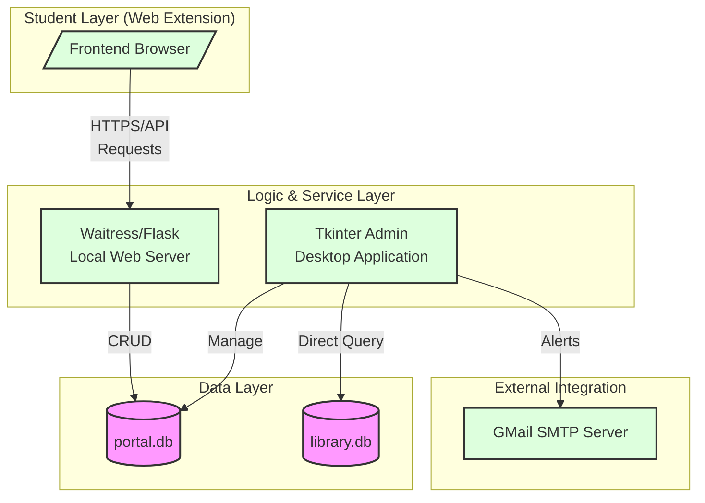
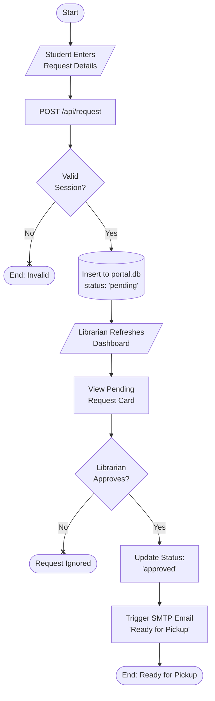
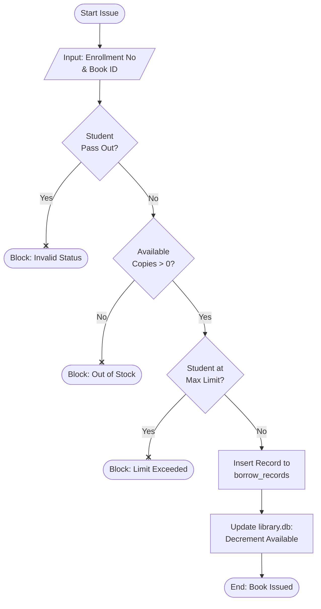
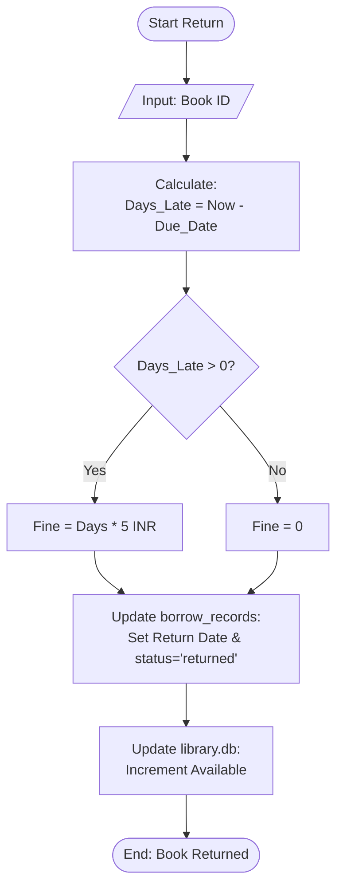
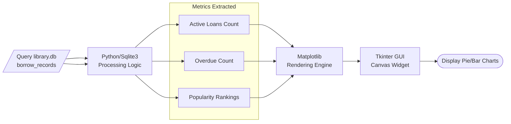
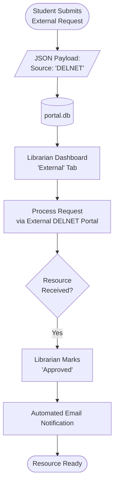
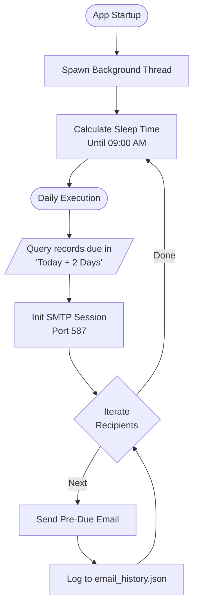

# IARE Project Diagrams Walkthrough

This document presents the visual documentation for the **Integrated Academic
Resource Ecosystem (IARE)**. All diagrams use standard industry notations and
have been refined for clarity and proper text fitting.

---

## 1. System Architecture Block Diagram

This high-level diagram illustrates the hybrid nature of the ecosystem, where a
local desktop application serves as the core authority and backend for a
web-based student extension.

### In-Depth Explanation:

The architecture is a **Hybrid Decentralized Model**.

- **The Student Layer**: Operates as a thin client (Web Extension) that
  communicates via an API.
- **The Logic Layer**: Is dual-purpose. The **Waitress/Flask** server handles
  non-blocking web requests (booking requests, profile views), while the
  **Tkinter Admin App** provides a heavy-duty UI for the librarian to perform
  physical transactions.
- **The Data Layer**: Uses two separate SQLite databases to decouple core
  library inventory (`library.db`) from volatile portal requests (`portal.db`),
  ensuring system stability even if the web service is under load.

---

## 2. Feature 1: Book Reservation / Request Workflow

This flow depicts the asynchronous "Request -> Approval" queue, where a student
expresses interest, but no inventory is moved until administrative intervention.

### In-Depth Explanation:

1. **Initiation**: The student starts by submitting a request through the
   extension. This is a non-committal data entry.
2. **Server Validation**: The Flask API validates the session before writing to
   the `requests` table in `portal.db`. The status is explicitly set to
   `pending`.
3. **Human-in-the-Loop**: Unlike automated e-commerce, this system requires a
   Librarian's manual review. This prevents inventory locking by inactive
   students.
4. **Completion**: Once approved, the system transitions from a database update
   to an external side-effect (sending an email via SMTP), notifying the student
   that the physical book is now being held for them.

---

## 3. Feature 2: Transaction Cycle (Issue & Return)

The core physical operations of the library. These flows follow strict
validation rules to maintain inventory integrity.

#### Book Issue Process

#### Book Return Process

### In-Depth Explanation:

- **Issue Workflow**: This is a **Guard-Pattern** flow. The system checks three
  critical conditions (Student Status, Content Availability, and Borrowing
  Limits) before allowing a database write. This ensures the library never
  over-promises or issues books to inactive students.
- **Return Workflow**: This is a **Calculation-First** flow. The priority is
  determining financial liability (Fine) before resetting the inventory status.
  The incrementing of `available_copies` only happens after the transaction
  record is closed.

---

## 4. Feature 4: Analytics/Graph Generation

Visual representation of library health through dynamic data processing.

### In-Depth Explanation:

- **Data Acquisition**: The system performs aggregate SQL queries (e.g.,
  `COUNT`, `GROUP BY`) on the `borrow_records` table.
- **Processing**: Python logic cleans this data, handling dates and status
  strings to ensure the counts are accurate for the "Analysis" tab.
- **Integration**: IARE uses **Matplotlib** for high-fidelity scientific
  plotting. The resulting chart is not a static image but a live-rendered
  component embedded directly into the Tkinter application's layout.

---

## 5. Feature 5: DELNET / External Resource Request

Managing resources that exist outside the local library's inventory.

### In-Depth Explanation:

This workflow is a **Proxy-Process**.

- **The Digital Shell**: The student uses the IARE extension to create a digital
  trace of their request.
- **The Physical Bridge**: The Librarian acts as the coordinator with the
  external DELNET network.
- **Closing the Loop**: Once the resource physically arrives, the Librarian
  updates the status in IARE, which triggers the digital notification system
  (SMTP) to alert the student.

---

## 6. Feature 6: Automated Email Logic

The background "Watchdog" process that ensures students are reminded of their
deadlines.

### In-Depth Explanation:

- **Persistence**: Unlike standard UI actions, this is a **Daemon Process** that
  runs as long as the Admin App is open.
- **Timing Constraint**: It uses a smart sleep logic to avoid spamming; it only
  activates once a day at 09:00 AM.
- **The 2-Day Rule**: The logic specifically targets users whose deadline is
  exactly 48 hours away, providing a "Pre-Due" cushion.
- **Fault Tolerance**: Every action is logged to `email_history.json`, allowing
  the Librarian to audit if reminders are actually being delivered.
