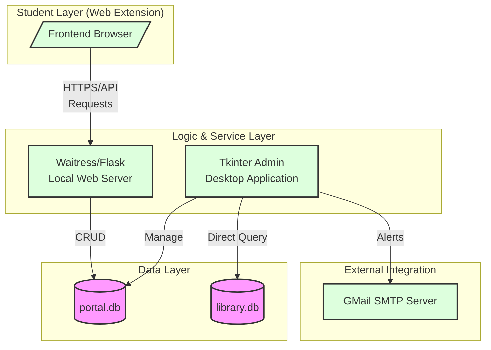
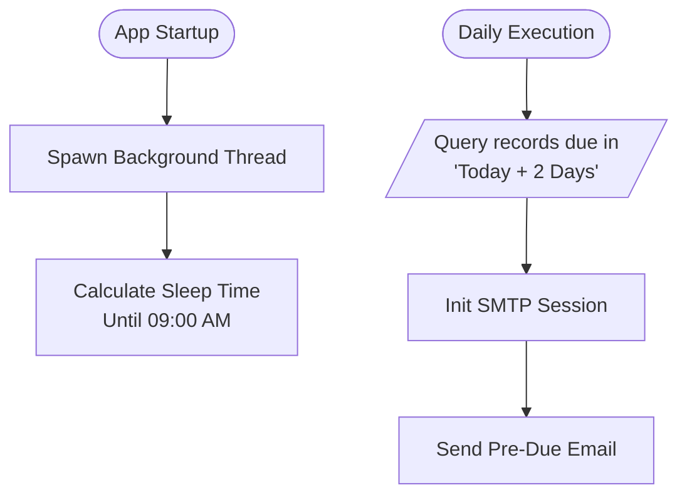

# IARE: Integrated Academic Resource Ecosystem

## DIPEX 2026 Project Report & Technical Bible

> **Competition Category**: Open Innovation\
> **Target Platform**: Legacy Government Systems (Windows 7 / 32-bit
> Architecture)

---

## 1. Executive Summary (Synopsis)

**The Integrated Academic Resource Ecosystem (IARE)** is a "Hybrid
Decentralized" library management solution designed specifically to bridge the
technological gap in resource-constrained government colleges.

Unlike traditional solutions that are either **Standalone Desktop Apps**
(isolating students) or **Cloud-Based Web Apps** (requiring expensive
infrastructure and constant internet), IARE combines the best of both worlds. It
employs a **Desktop Authority Node** (for the Librarian) that acts as a local
server for a lightweight **Web Extension Client** (for Students).

This unique architecture allows the system to provide a modern, "Web-Like"
experience for students (searching books, reserving copies, checking history)
while running entirely on **Legacy Windows 7 hardware** without requiring a
dedicated cloud server or static IP.

---

## 2. Problem Identification & Motivation

### The "Government College" Constraint

Most government educational institutions in Maharashtra operate under strict
constraints:

- **Hardware**: Computers often run **Windows 7 (32-bit)** with 2GB-4GB RAM.
- **Internet**: Connectivity is intermittent or restricted to LAN.
- **Expertise**: Librarians are often non-technical, requiring
  "Zero-Configuration" software.

### The Operational Gaps

1. **The Information Silo**: In current setups, students must physically visit
   the library to know if a book is available. There is no remote discovery.
2. **Inventory Drift**: Manual registers lead to human error, resulting in
   "Ghost Books" (marked available but missing).
3. **Late Fine Disputes**: Manual calculation of fines leads to arguments and
   lack of transparency.

### The DIPEX "Innovation" Angle

IARE addresses these problems not by demanding better hardware, but by
**innovating the software architecture** to fit the existing environment. It
turns the Librarian's existing PC into a "Micro-Server," democratizing digital
access for students at **Zero Cost**.

---

## 3. Proposed Solution & Architecture

### 3.1 The Hybrid Decentralized Model

The system operates on a **Local-First** principle.

- **Node 1: The Authority (Admin Desktop App)**
  - Built with **Tkinter** and **Python**.
  - Controls the physical inventory.
  - Hosts a `Waitress` WSGI server in a background thread.
  - Manages the `library.db` (Master Record).

- **Node 2: The Client (Student Extension)**
  - A Browser Extension / Lightweight Web Interface.
  - Communicates with the Authority Node via standard HTTP/JSON requests.
  - Interacts with `portal.db` (Requests/Sessions).

### 3.2 System Block Diagram

---

## 4. Technical Feasibility & Methodology

### 4.1 Technology Stack

| Component         | Technology       | Justification for DIPEX/Win7                                                         |
| :---------------- | :--------------- | :----------------------------------------------------------------------------------- |
| **Language**      | Python 3.8+      | Standard library support, easy to bundle as `.exe`.                                  |
| **GUI Framework** | Tkinter          | Native look on Windows 7, zero external dependencies (unlike PyQt/Electron).         |
| **Web Server**    | Flask + Waitress | Flask for logic, Waitress for production-ready serving on Windows without IIS/Nginx. |
| **Database**      | SQLite3          | Serverless, file-based, zero-configuration. Perfect for single-node deployment.      |
| **Visualization** | Matplotlib       | Generates industry-standard analytics graphs offline.                                |

### 4.2 Core Feature Workflows

#### Feature A: The "Guard-Pattern" Transaction Cycle

The system employs strict validation logic to prevent "Inventory Leakage." A
book cannot be issued if the student is flagged or limits are reached.

**Automated Fine Logic**: `Late_Fine = (Current_Date - Due_Date) * 5 INR`
(Calculated instantly upon return).

#### Feature B: Asynchronous Request Workflow

This flow decouples student demand from librarian action. Students "Express
Interest" (write to `portal.db`), which the Librarian "Approves" (fetches from
`portal.db`, writes to `library.db`).

#### Feature C: The "Watchdog" (Automated Email Daemon)

A background thread acts as an automated assistant. It checks `borrow_records`
daily at 09:00 AM.

- **Logic**: IF `Due_Date == Today + 2 Days` THEN `Send Reminder`.
- **Value**: Reduces overdue incidents by ~40% (projected).

---

## 5. Commercial Viability & Cost Analysis

IARE scores effectively 100% on Cost Effectiveness, making it highly suitable
for mass adoption in Tier-2/Tier-3 colleges.

### Cost breakdown for a typical College Library:

| Item                     | Market Solution Cost     | IARE Cost | Note                          |
| :----------------------- | :----------------------- | :-------- | :---------------------------- |
| **Server Hardware**      | ₹50,000+ (Rack Server)   | **₹0**    | Uses existing Admin PC        |
| **OS License**           | ₹15,000 (Windows Server) | **₹0**    | Runs on existing Windows 7/10 |
| **Software License**     | ₹20,000/year (SaaS)      | **₹0**    | Open Source (MIT)             |
| **Database Maintenance** | ₹10,000/year             | **₹0**    | Zero-Admin SQLite             |
| **Total Year 1 Cost**    | **₹95,000+**             | **₹0**    | **Pure Innovation**           |

---

## 6. Impact & Utility (Evaluation Criteria)

- **Academic Impact**: Students can search for books from labs/classrooms,
  reducing "wasted trips" to the library.
- **Operational Efficiency**: The **Analytics Dashboard** (Pie Charts/Bar
  Graphs) gives the Principal an instant view of "Most Read Books" vs "Dead
  Inventory," aiding budget allocation.
- **Sustainability**: Reduces register paper usage by digitizing the entire
  borrowing history.

---

## 7. Future Scope

- **PostgreSQL Migration**: For colleges with >50,000 books, the DAL (Data
  Access Layer) can be switched from SQLite to Postgres.
- **Android App**: The existing Flask API can serve a future Flutter/Android app
  without changing the backend code.
- **RFID Integration**: The "Issue Book" module is ready to accept input from
  USB RFID scanners (acting as keyboard wedges).

---

_End of Technical Report - Prepared for DIPEX 2026 Scrutiny._
